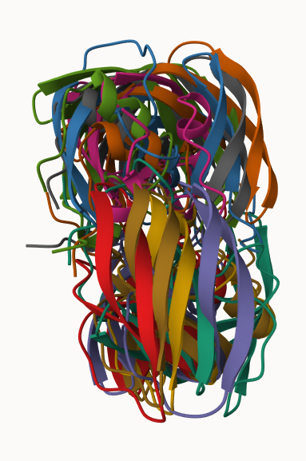

# Class 9 Structural Bioinformatics
A17576411

\#First what is in the PDB database - the main repository of protein
structures

> Q1: What percentage of structures in the PDB are solved by X-Ray and
> Electron Microscopy.

``` r
stats <- read.csv("PDBstats.csv", row.names = 1)
x <- stats$X.ray
x
```

    [1] "158,844" "9,260"   "8,307"   "2,730"   "164"     "11"     

``` r
stats
```

                              X.ray     EM    NMR Multiple.methods Neutron Other
    Protein (only)          158,844 11,759 12,296              197      73    32
    Protein/Oligosaccharide   9,260  2,054     34                8       1     0
    Protein/NA                8,307  3,667    284                7       0     0
    Nucleic acid (only)       2,730    113  1,467               13       3     1
    Other                       164      9     32                0       0     0
    Oligosaccharide (only)       11      0      6                1       0     4
                              Total
    Protein (only)          183,201
    Protein/Oligosaccharide  11,357
    Protein/NA               12,265
    Nucleic acid (only)       4,327
    Other                       205
    Oligosaccharide (only)       22

``` r
as.numeric(gsub(",", "", x))
```

    [1] 158844   9260   8307   2730    164     11

``` r
as.numeric(gsub(",", "", stats$EM))
```

    [1] 11759  2054  3667   113     9     0

``` r
sum()
```

    [1] 0

``` r
rm.comma <- function(x) {
  as.numeric(gsub(",", "", x))
}
rm.comma(stats$EM)
```

    [1] 11759  2054  3667   113     9     0

\#I can use apply to fix the entire table

``` r
pdbstats <- apply(stats, 2, rm.comma)
pdbstats
```

          X.ray    EM   NMR Multiple.methods Neutron Other  Total
    [1,] 158844 11759 12296              197      73    32 183201
    [2,]   9260  2054    34                8       1     0  11357
    [3,]   8307  3667   284                7       0     0  12265
    [4,]   2730   113  1467               13       3     1   4327
    [5,]    164     9    32                0       0     0    205
    [6,]     11     0     6                1       0     4     22

``` r
totals <- apply(pdbstats, 2, sum)
round(totals/totals["Total"]*100,2)
```

               X.ray               EM              NMR Multiple.methods 
               84.83             8.33             6.68             0.11 
             Neutron            Other            Total 
                0.04             0.02           100.00 

A: 84.83% is solved by X-Ray, 8.33% is solved by EM

> Q2: What proportion of structures in the PDB are protein?

``` r
pdbstats
```

          X.ray    EM   NMR Multiple.methods Neutron Other  Total
    [1,] 158844 11759 12296              197      73    32 183201
    [2,]   9260  2054    34                8       1     0  11357
    [3,]   8307  3667   284                7       0     0  12265
    [4,]   2730   113  1467               13       3     1   4327
    [5,]    164     9    32                0       0     0    205
    [6,]     11     0     6                1       0     4     22

``` r
proteinsum <- pdbstats[1, "Total"]
round(pdbstats[1, "Total"]/sum(pdbstats[, "Total"]) *100)
```

    Total 
       87 

A: 87%

> Q3: Type HIV in the PDB website search box on the home page and
> determine how many HIV-1 protease structures are in the current PDB?

skip this one

Here is a lovely figure of HIP-Pr with the catalytic ASP residues, the
MK1 compund, and the all important water 308

> Q4: Water molecules normally have 3 atoms. Why do we see just one atom
> per water molecule in this structure?

A: the hydrogen molecules are so small that they are almost
insignificant and thus are not needed to be displayed in the structure

> Q5: There is a critical “conserved” water molecule in the binding
> site. Can you identify this water molecule? What residue number does
> this water molecule have?

A: HOH 308

> Q6: Generate and save a figure clearly showing the two distinct chains
> of HIV-protease along with the ligand. You might also consider showing
> the catalytic residues ASP 25 in each chain and the critical water (we
> recommend “Ball & Stick” for these side-chains). Add this figure to
> your Quarto document.


